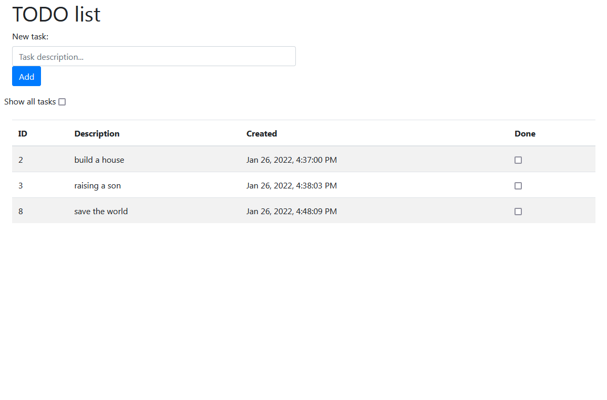
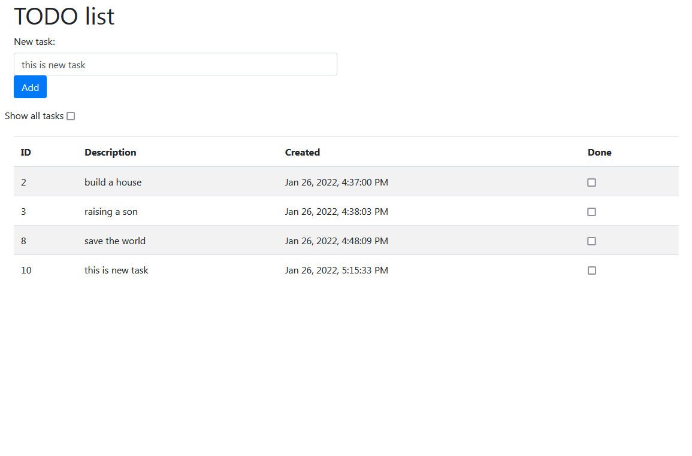
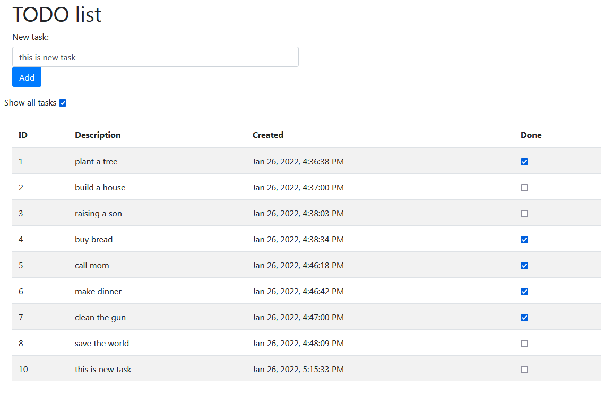

# job4j_todo
To do list

Одностраничное приложение со списком дел.
Если дело сделано, то его отмечают, как выполненное.
Если отметить задачу как выполненную - она исчезает из списка.
Если включить режим "показать все" - будут показаны все задачи, в т.ч. выполненные.
Задачу можно отметить обратно как невыполненную.

1. Одна таблица в базе items с полями id, description, created, done.
2. Веб приложение имеет одну страницу index.html.
3. Все данные на форму загружаются через ajax.
4. Вверху форма добавления нового задания.
5. Галочка включения режима "показать все". Если включена - показываются все дела, если нет - только те, что не выполнены.
6. Список всех заданий, у каждого галка выполнено или нет.
7. Данные сохраняются через hibernate.
8. Для построения UI используется bootstrap.

